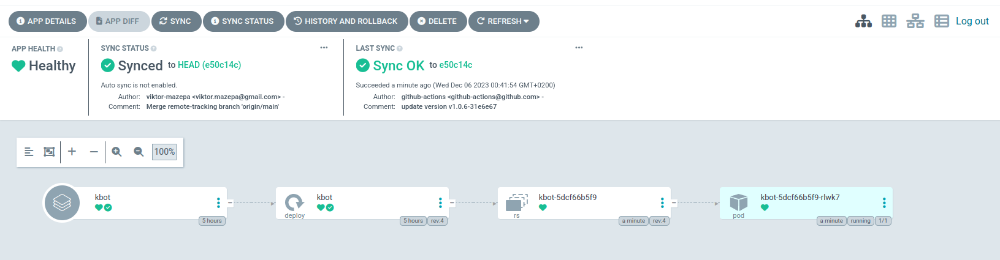

# <a href="https://t.me/viktormazepa_bot">Telegram kBot</a>
## Link - <a href="https://t.me/viktormazepa_bot">https://t.me/viktormazepa_bot</a>
## CI/CD
### Is configured via GitHub WorkFlow and contains next steps:

* CI :
  + Action CheckOut
  + Run Tests
  + Login to Google Artifactory Repository 
  + Build and Push docker image to Google Artifactory Repository
  + Clean
* CD:
  + Save tag and revision to $GITHUB_ENV
  + Update image.tag into values.yaml 
  + Commit changes and push

### Example of GitHub WorkFlow


### Example of ArgoCD deployment 


## How to install and run latest release via HELM
```
helm install kbot-0.1.0 https://github.com/viktor-mazepa/kbot/archive/refs/tags/v1.0.6.tar.gz 
```

## How to install and run locally
Install Go on your computer https://go.dev/doc/install 

Clone git repository:
```
git clone https://github.com/viktor-mazepa/kbot.git kBot
```
Navigate into kbot folder:
```
cd kBot
```
Build application
```
go build -ldflags "-X 'github.com/viktor-mazepa/kbot/cmd.appVersion=v1.0.3'"
```
Import telegram token ```TELE_TOKEN``` or add system variable into the end of your ```bashrc``` file via text redactor:
```
export TELE_TOKEN=<your_telegram_token>
```
Run application:
```
./kbot start
```

Telegram kBot can return to Telegram user some answers.

For example if you send ```/start hello``` , bot will send hello message with version ```Hello I'm Kbot v1.0.3```

If you send ```/start time``` , bot will send you current date and time in format: ```08-11-2023 20:29:28```

If you send ```/start version```, bot will send you current version of application in format: ```Current kBot version v1.0.3```

You also can ask bot ```/start how are you?```

You can try to send some photos or voice message and you will see what happens
